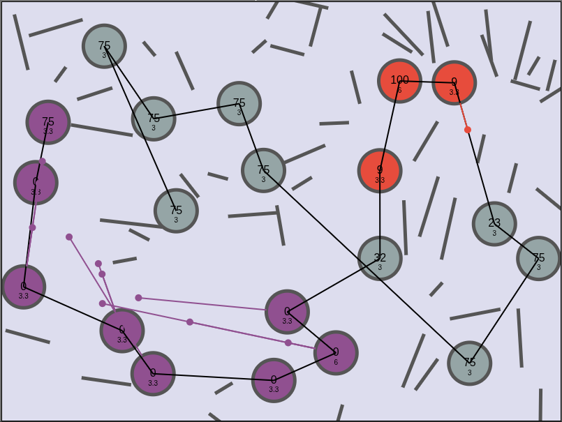

# Node Takeover



A strategic territory control game where players compete to take over nodes on a dynamic gameboard. Build your forces, capture neutral nodes, and defeat your opponent in this engaging strategy game.

## 🎮 Features

- **Strategic Gameplay**: Capture and control nodes to generate units and expand your territory
- **Computer AI**: Play against an AI opponent
- **Procedural Generation**: Unique game boards generated from seed values for endless replayability
- **Unit Management**: Generate and dispatch units to capture enemy nodes
- **Obstacle System**: Navigate around walls that block unit movement
- **Responsive Design**: Play on various screen sizes
- **Customizable Settings**: Adjust game parameters for different difficulty levels

## 🚀 Getting Started

### Prerequisites

- Modern web browser (Chrome, Firefox, Safari, Edge)
- Node.js (for development)

### Installation

1. Clone the repository:
   ```bash
   git clone https://github.com/david-slimp/NodeTakeOver.git
   cd NodeTakeOver
   ```

2. Open `index.html` in your web browser to start playing!

## 🌐 Play Online

You can play the game online at: https://rock808.com/games/NodeTakeOver/

## 🎯 How to Play

1. **Objective**: Capture all enemy nodes on the board.
2. **Controls**:
   - Click on a node you control to select it
   - MouseDrag to an enemy or neutral node to send units to capture it
   - Use the seed input to replay specific game maps
   - Click "Restart" to begin a new game with the current seed

## 🛠 Development

### Project Structure

- `index.html` - Main game interface
- `main.js` - Game initialization and main loop
- `game.js` - Core game logic and state management
- `config.js` - Game configuration and constants
- `style.css` - Game styling


## 📝 License

This project is licensed under the GPL License - see the [LICENSE](LICENSE) file for details.

## 👏 Contributing

Contributions are welcome! Please feel free to submit a Pull Request.

## 📧 Contact

David Slimp - [rock808@David-Slimp.com](mailto:rock808@David-Slimp.com)

Project Link: [https://github.com/david-slimp/NodeTakeOver](https://github.com/david-slimp/NodeTakeOver)
